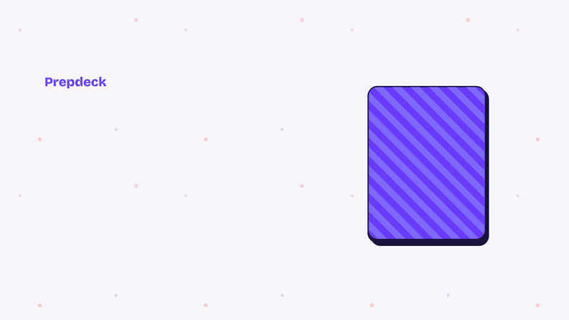

# Prepdeck

Interview practice as a card game: pick an industry and role, shuffle the deck, and answer the question you're dealt, with notes on what a strong answer needs. Answer out loud and get your answer graded on Content, Fluency and Pacing, entirely in your browser.

**Live:** https://prepdeck-psi.vercel.app



▶ [Watch the launch video with sound](docs/media/prepdeck-launch.mp4)

| Role | Link |
| --- | --- |
| Frontend Engineer (React, Next.js) | https://prepdeck-psi.vercel.app/technology/frontend |
| Backend Engineer (Node.js, Python) | https://prepdeck-psi.vercel.app/technology/backend |
| Fullstack Engineer (React, Next.js, Node.js) | https://prepdeck-psi.vercel.app/technology/fullstack |
| HR M&A Manager (People in Deals) | https://prepdeck-psi.vercel.app/m-and-a/hr-ma-manager |

Every role also gets the general behavioural questions (conflict, leadership, success, failure, pressure, feedback). Question types: Behavioural, Situational, Technical, Case study, Role-specific, Culture fit and Curveball.

## Run it

```bash
npm install
npm run dev        # http://localhost:3000
```

With no Sanity settings the app runs on the built-in seed questions in `lib/content/seed.ts`.

```bash
npm test             # grading, chunking, session, deck logic and importer tests
npm run typecheck
npm run build
npm run test:golden  # 30 golden answers through the real embedding model (downloads MiniLM once)
```

## Deploy

Hosted on Vercel, connected to this repository:

- A push to `main` deploys production at https://prepdeck-psi.vercel.app.
- Every other branch and pull request gets its own preview deployment (Vercel sign-in required).
- Manual deploy: `vercel deploy --prod`.

The site sends `Cross-Origin-Opener-Policy` and `Cross-Origin-Embedder-Policy` headers (`next.config.ts`) so in-browser analysis can use multi-threaded WebAssembly. Any third-party script, iframe or image added later must send CORP or CORS headers, or the browser will block it.

## Stack

Next.js 16 (App Router) · TypeScript · Tailwind CSS 4 · [Motion](https://motion.dev) · Sanity (question bank) · Zod · Transformers.js and Silero VAD (on-device speech analysis). Fonts are self-hosted from npm (Bricolage Grotesque, Plus Jakarta Sans).

## How content works

The question bank lives in Sanity, so reviewers can add or fix questions at any time without a deploy.

1. An editor publishes a change in Sanity Studio (`studio/`).
2. A Sanity webhook calls `POST /api/revalidate`, which checks the signature and runs `revalidateTag('questions')`.
3. The next visitor gets the new content. Between edits the app serves a cached copy.

Only questions with **Review = Approved** reach the app.

Every question is tagged at the most general layer where it applies:
Universal → Industry → Role family → Specialisation → Stack, with level as a filter. See `lib/deck.ts` for the matching rule.

### Set up Sanity

1. Create a project at sanity.io and copy its project ID.
2. `cp .env.example .env.local` and fill in `NEXT_PUBLIC_SANITY_PROJECT_ID`, `SANITY_API_READ_TOKEN` and a random `SANITY_REVALIDATE_SECRET`. Add the same variables in the Vercel project settings for production.
3. Studio: `cd studio && npm install && SANITY_STUDIO_PROJECT_ID=... npm run dev`.
4. Add a webhook in Sanity (API → Webhooks): URL `https://prepdeck-psi.vercel.app/api/revalidate`, trigger on create/update/delete, filter `_type in ["question","industry","roleFamily","specialisation"]`, secret = `SANITY_REVALIDATE_SECRET`.

### Import the pilot question bank

Export the question bank doc as Markdown, then:

```bash
npm run import:bank -- ~/Downloads/question-bank.md   # writes question-bank.ndjson, reports bad rows
cd studio && npm run import                            # loads it into the production dataset
```

IDs are stable (`question-FE-01`), so re-importing updates rather than duplicates. The ID prefix sets the question's scope (see `scripts/import-question-bank.ts`).

## Spoken answer analysis (v2)

On a dealt card, **Analyse my answer** opens a full-screen overlay: record up to 3 minutes and get Content, Fluency and Pacing ratings with a breakdown. Everything runs in the browser (Whisper `base.en`, Silero VAD and MiniLM via Transformers.js, about 135 MB downloaded once and cached), and the answer is transcribed in ~25 s chunks while you speak so results arrive a few seconds after Stop. No audio, transcript or score leaves the device, and nothing is saved; the models themselves are downloaded once from Hugging Face and jsDelivr. Works best in Chrome or Edge on a laptop.

- Content: share of the question's "strong answer covers" points the answer covered
- Fluency: filler words plus hesitations (voiced pauses Whisper folds into words) per minute
- Pacing: long silences, speaking rate and length
- Thresholds: `lib/analysis/thresholds.ts`
- `/lab/speech` (development only) compares model profiles and measures streaming speed

Design and decisions: [PRD](docs/superpowers/specs/2026-10-03-v2-spoken-answer-analysis-design.md) · [Stage 0 results](docs/superpowers/specs/2026-10-03-v2-stage0-results.md) · [Implementation plan](docs/superpowers/plans/2026-10-03-v2-spoken-answer-analysis.md)

## Project layout

```
app/                      routes: industries → roles → practice table; /api/revalidate; /lab/speech (dev only)
components/Deck.tsx       shuffle styles (Riffle, Fan, Instant), dealing, keyboard controls
components/QuestionCard   dealt card with flip-in animation
components/TipsPanel      what they're asking / strong answer covers / avoid / example outline
components/analysis/      Analyse my answer overlay: setup, recording, results, transcript
lib/content/              Zod schema, Sanity source with tagged caching, dev seed
lib/deck.ts               deck filtering + Fisher–Yates shuffle
lib/analysis/             grading: fluency, hesitations, pacing, content, ratings (pure functions)
lib/speech/               recorder, chunker, model profiles, worker client, overlay session
workers/                  Web Worker running Whisper, VAD and MiniLM
scripts/                  question bank importer, golden set runner
studio/                   Sanity Studio config and schema
docs/                     PRD, Stage 0 results, implementation plan
```

## Next up

- Calibrate grading with ~20 real recorded answers (golden-set agreement is 77%, target 80%).
- Compare the `quality` and `compact` model profiles and time a streamed 3-minute answer (target under 15 s).
- Practice timer, favourites, self-rating and session summary.
- Analytics: Vercel Analytics or PostHog (open decision).
